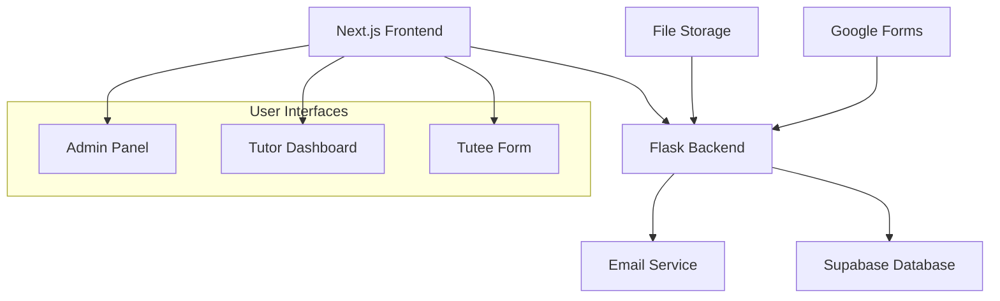

# Design Document

## Overview

The tutoring automation system is a web-based platform that streamlines the connection between tutees and tutors through an automated workflow. The system integrates Google Forms for tutee requests, provides a dashboard for tutors to view and apply for opportunities, and includes administrative controls for tutor approval management. The architecture follows a modern web application pattern with a Next.js frontend, Flask backend, and Supabase database.

## Architecture

### High-Level Architecture



### Technology Stack

- **Frontend**: Next.js with React for the web application
- **Backend**: Flask (Python) for API and business logic
- **Database**: Supabase (PostgreSQL) for data persistence
- **Form Integration**: Google Forms API for tutee requests
- **Email**: Integrated email service for notifications
- **File Storage**: Cloud storage for session recordings
- **Authentication**: Supabase Auth for user management

### Design Rationale

- **Next.js Frontend**: Chosen for its server-side rendering capabilities, excellent developer experience, and seamless integration with modern React patterns
- **Flask Backend**: Selected for its simplicity and Python ecosystem, making it ideal for rapid development and Google Forms integration
- **Supabase**: Provides real-time database capabilities, built-in authentication, and reduces infrastructure complexity
- **Microservices Approach**: Separating concerns between form processing, user management, and scheduling allows for better maintainability

## Components and Interfaces

### Core Components

#### 1. Form Integration Service
- **Purpose**: Processes Google Forms submissions and creates tutoring opportunities
- **Interfaces**: 
  - Google Forms webhook endpoint
  - Tutoring opportunity creation API
- **Key Functions**:
  - Parse form data (email, subject, availability, location)
  - Validate and sanitize input
  - Create new tutoring opportunities in database

#### 2. User Management System
- **Purpose**: Handles tutor registration, authentication, and profile management
- **Interfaces**:
  - Registration/login endpoints
  - Profile management API
  - Subject approval system
- **Key Functions**:
  - Tutor account creation with school affiliation
  - Authentication and session management
  - Subject-specific approval tracking

#### 3. Opportunity Management
- **Purpose**: Displays available tutoring jobs and handles applications
- **Interfaces**:
  - Opportunities listing API
  - Job application endpoint
  - Assignment management
- **Key Functions**:
  - Filter opportunities by school and tutor approvals
  - First-come-first-served job assignment
  - Real-time opportunity board updates

#### 4. Scheduling System
- **Purpose**: Manages session scheduling and coordination
- **Interfaces**:
  - Scheduling interface
  - Time proposal system
  - Cancellation management
- **Key Functions**:
  - Display tutee availability windows
  - Auto-confirm sessions within availability
  - Handle alternative time proposals

#### 5. Administrative Dashboard
- **Purpose**: Provides superadmin controls for tutor approval management
- **Interfaces**:
  - Admin authentication
  - Tutor approval API
  - School-specific management
- **Key Functions**:
  - View all tutors by school
  - Manage subject-specific approvals
  - Track approval status changes

#### 6. Session Management
- **Purpose**: Handles completed sessions and volunteer hour tracking
- **Interfaces**:
  - Recording upload endpoint
  - Hour calculation service
  - Hour withdrawal system
- **Key Functions**:
  - Process audio/video uploads
  - Calculate hours from file duration
  - Maintain volunteer hour balances

#### 7. Notification System
- **Purpose**: Sends automated emails for confirmations and updates
- **Interfaces**:
  - Email template system
  - Notification triggers
  - Communication logging
- **Key Functions**:
  - Send session confirmations
  - Include meeting details and contact info
  - Log all communications

## Data Models

### User Models

#### Tutor
```typescript
interface Tutor {
  id: string
  email: string
  name: string
  school: string
  createdAt: Date
  subjectApprovals: SubjectApproval[]
  volunteerHours: number
  activeJobs: TutoringJob[]
}
```

#### SubjectApproval
```typescript
interface SubjectApproval {
  id: string
  tutorId: string
  subject: string
  approvedBy: string
  approvedAt: Date
  status: 'pending' | 'approved' | 'denied'
}
```

#### Superadmin
```typescript
interface Superadmin {
  id: string
  email: string
  name: string
  school: string
  permissions: string[]
}
```

### Job Models

#### TutoringOpportunity
```typescript
interface TutoringOpportunity {
  id: string
  tuteeEmail: string
  subject: string
  availabilityStart: Date
  availabilityEnd: Date
  location: string
  school: string
  status: 'open' | 'assigned' | 'completed' | 'cancelled'
  priority: 'normal' | 'high'
  createdAt: Date
  assignedTutorId?: string
}
```

#### TutoringJob
```typescript
interface TutoringJob {
  id: string
  opportunityId: string
  tutorId: string
  tuteeEmail: string
  scheduledTime?: Date
  location: string
  status: 'assigned' | 'scheduled' | 'completed'
  sessionRecording?: string
  hoursEarned?: number
}
```

### Session Models

#### SessionRecording
```typescript
interface SessionRecording {
  id: string
  jobId: string
  filePath: string
  duration: number
  uploadedAt: Date
  fileType: 'audio' | 'video'
}
```

#### Communication
```typescript
interface Communication {
  id: string
  jobId: string
  type: 'confirmation' | 'reminder' | 'cancellation'
  recipients: string[]
  sentAt: Date
  content: string
}
```

## Error Handling

### API Error Responses
- **400 Bad Request**: Invalid input data or missing required fields
- **401 Unauthorized**: Authentication required or invalid credentials
- **403 Forbidden**: Insufficient permissions for requested action
- **404 Not Found**: Requested resource does not exist
- **409 Conflict**: Resource conflict (e.g., job already assigned)
- **500 Internal Server Error**: Unexpected server errors

### Error Recovery Strategies
- **Form Submission Failures**: Retry mechanism with exponential backoff
- **Database Connection Issues**: Connection pooling and automatic reconnection
- **Email Delivery Failures**: Queue system with retry logic
- **File Upload Errors**: Chunked upload with resume capability

### User Experience Considerations
- Clear error messages for form validation
- Loading states during async operations
- Graceful degradation when services are unavailable
- Offline capability for viewing existing data

## Testing Strategy

### Unit Testing
- **Backend**: Flask route testing with pytest
- **Frontend**: Component testing with Jest and React Testing Library
- **Database**: Model validation and relationship testing
- **Utilities**: Helper function and validation logic testing

### Integration Testing
- **API Integration**: End-to-end API workflow testing
- **Database Integration**: Data persistence and retrieval testing
- **External Services**: Google Forms and email service integration
- **Authentication Flow**: Complete user authentication scenarios

### End-to-End Testing
- **User Workflows**: Complete tutee-to-tutor journey testing
- **Admin Workflows**: Superadmin approval and management flows
- **Cross-browser Testing**: Compatibility across major browsers
- **Mobile Responsiveness**: Touch interface and responsive design

### Performance Testing
- **Load Testing**: Concurrent user simulation
- **Database Performance**: Query optimization and indexing
- **File Upload Testing**: Large file handling and storage limits
- **Real-time Updates**: WebSocket connection stability

### Security Testing
- **Authentication Security**: Session management and token validation
- **Input Validation**: SQL injection and XSS prevention
- **File Upload Security**: Malicious file detection and sanitization
- **Access Control**: Permission-based resource access verification

## Security Considerations

### Authentication & Authorization
- JWT-based authentication with refresh tokens
- Role-based access control (tutor, superadmin)
- School-based data isolation
- Session timeout and secure logout

### Data Protection
- Input sanitization and validation
- SQL injection prevention through parameterized queries
- XSS protection with content security policies
- File upload restrictions and virus scanning

### Privacy & Compliance
- Email address encryption in database
- Secure file storage with access controls
- Audit logging for administrative actions
- GDPR-compliant data handling procedures